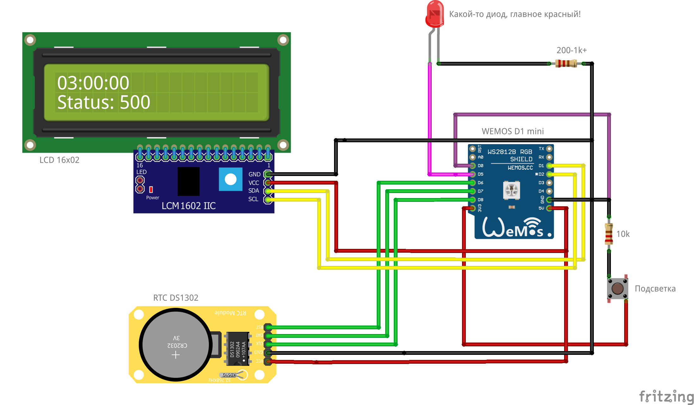

# ESP8266 Ping Alert 
Сервер вашего проекта постоянно падает? Соберите себе устройство на базе **ESP8266**, которое будет под рукой и будет его переодически пинговать! Если сайт упал, то загорится дисплей, заморгает диод и вы сразу же заметите это!

## Использованное оборудование
* **ESP8266** (В данном проекте был использован модуль **WEMOS D1 mini**)
* **LCD дисплей 16х2** (HD44780) с переходником на I2C
* Модуль часов реального времени **DS1302**

## Использованные библиотеки
* [LiquidCrystal I2C](https://github.com/johnrickman/LiquidCrystal_I2C)
* [Ds1302](https://github.com/Treboada/Ds1302)
* [ESP8266 Timer Interrupt](https://github.com/khoih-prog/ESP8266TimerInterrupt)

## Cхема сборки

## Настройка
Подключитесь через **Монитор порта** в **Arduino IDE**, с зажмите одновременно кнопку управления подсветкой и кнопку reset. Ответьте на вопросы через терминал.

## Планируется сделать
Проект находится в активной разработке, в планах следующие фичи:
* Управление реле при падении проекта, например, для использования с магнитным замком для окон и дверей в офисе, пока не поднимут сайт
* Расписание работы (если вы считаете что падение в 3 часа ночи, это норм)
* Пронзительный писк из спикера, действующий на нервы!